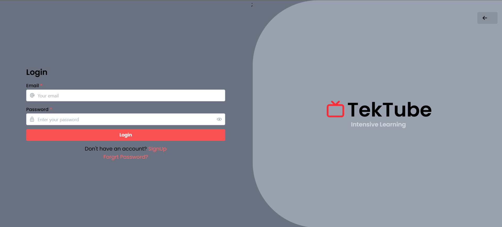
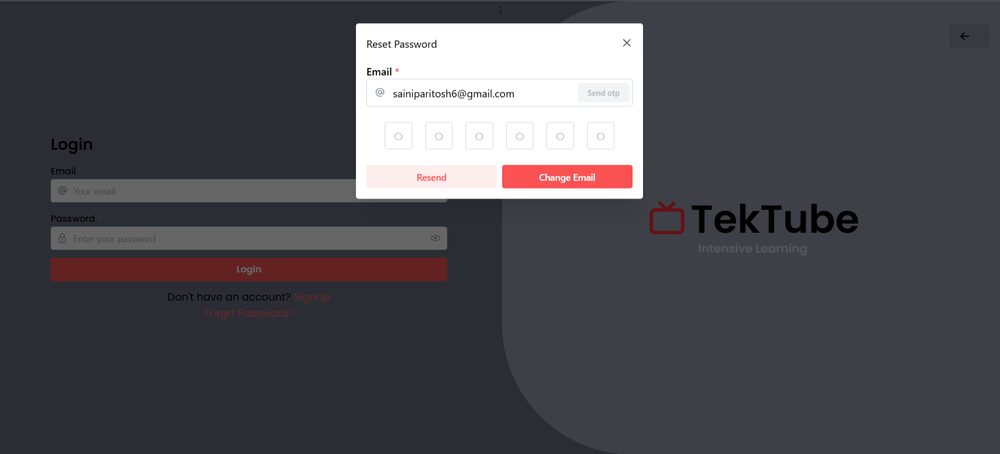
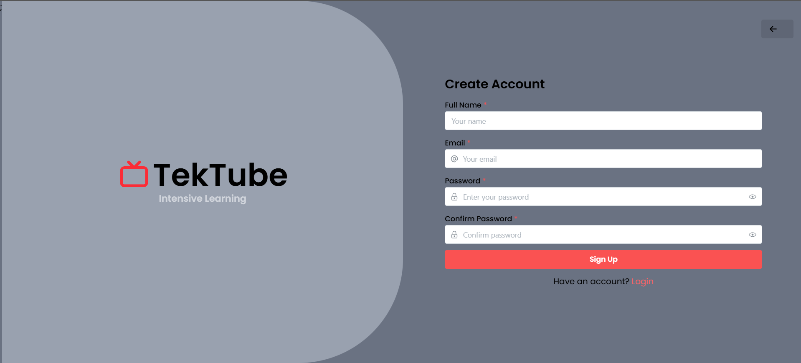
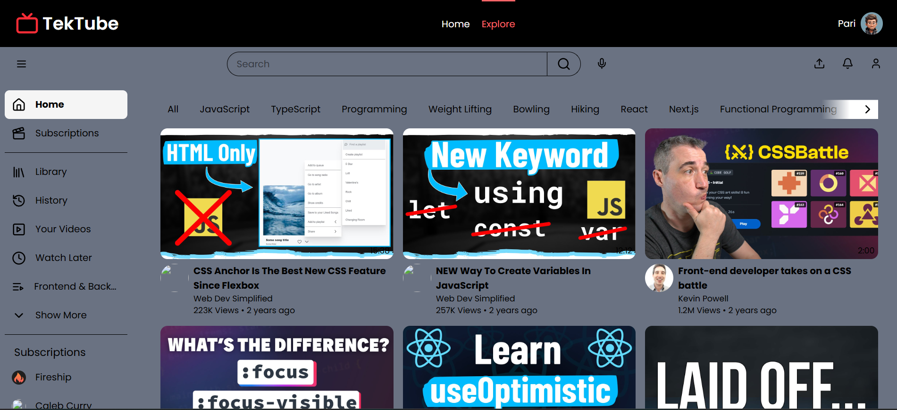

# Tektube 📺🚀

**Tektube** is a post-engagement learning platform designed specifically for new recruits in a company to help them learn the technologies used in-house and understand the specifics of the projects they'll be working on.

## 🌟 Project Overview

Onboarding new hires can be challenging—Tektube makes it easier by offering a centralized, intuitive, and engaging learning platform. Inspired by modern web platforms like YouTube and LinkedIn, Tektube provides video-based learning content, a personal profile system, and a robust authentication flow to make the learning process seamless and secure.

---

## 🛠️ Tech Stack

### Frontend
- **Vite** + **React** – Lightning-fast development and optimized performance
- **TailwindCSS** – Utility-first CSS for sleek UI
- **Mantine** – Advanced React components
- **Redux Toolkit** – For secure and efficient state management, especially login caching

### Backend
- **Java Spring Boot** – Robust and scalable backend services

### Database
- **MongoDB** – NoSQL database for flexible data modeling

---

## 🔐 Authentication Features

Tektube implements production-grade authentication:
- **Login Page** with full validation and error handling  
  
- **Forgot Password** functionality with OTP email verification
   
- **Secure Password Reset** via OTP
- **Signup Page** with complete validation for safe and smooth account creation
    
- **Stateful login** using Redux to cache session and auth states

---

## 📄 Pages & Features

### 🔸 Landing Page
- Engaging homepage for first-time users
- CTA for login and signup
  

### 🔸 Learning Page
- **YouTube-inspired UI** for easy navigation
- Seamless access to company-curated tech learning videos

### 🔸 Profile Page
- **LinkedIn-style design**
- Edit personal information, profile picture, and cover photo
- View assigned projects and roles
  

---

## 📬 Contact

For queries or suggestions, feel free to reach out at [sainiparitosh6@gmail.com]

